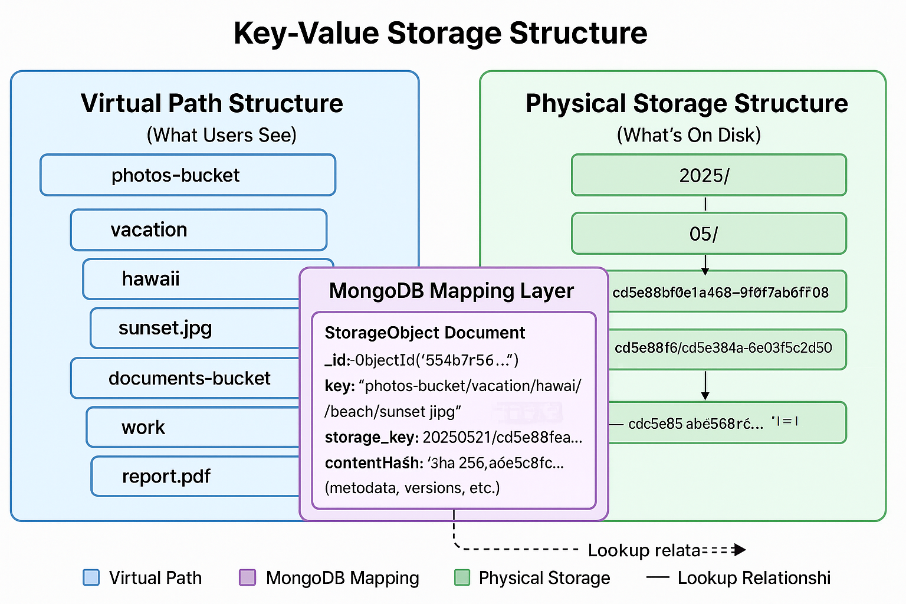

# Simple Cloud Storage Service (SCS2)

Cloud Storage Service (SCS2) is a web-based storage solution that allows users to store and retrieve files from a personal cloud-based storage space. The system implements core features of cloud storage platforms including user authentication, file management, access control, and search capabilities.

SCS2 is designed as a true key-value store at its foundation, similar to how distributed storage systems manage vast amounts of data while presenting a familiar, hierarchical view(logical) to users.

## Core Methodology

### 1. The Key-Value Storage Paradigm
The cornerstone of SCS2's design is the fundamental separation between how users perceive their data and how it is physically stored. This approach is inspired by the highly scalable nature of systems like Amazon S3.

1. Virtual Path Structure (Logical View)
Users interact with SCS2 through a familiar hierarchical structure, organizing their files into buckets and nested folders (e.g., /my-bucket/documents/reports/q1-2024.pdf). This provides an intuitive and organized experience, mirroring traditional file systems. This done just to improve readability, organization, and ease of navigation.
2. Physical Storage Structure (Actual Data Layout)
On the underlying disk, files are stored in a flat, non-hierarchical manner. Each file is assigned a unique, system-generated identifier (the storage key). It is done to simplify data distribution and avoids performance bottlenecks associated with deep directory traversals.
A central database, MongoDB, acts as the crucial mapping layer between the
virtual path structure and the physical storage structure.
Operations:
-   File Upload: When a file is uploaded, SCS2 generates a unique storage key,
saves the file to physical storage, and then creates a metadata record in MongoDB linking the virtual path to this key. Content hashing is used to detect and prevent duplicate physical storage of identical files.
-   File Retrieval: When a user requests a file by its virtual path, SCS2 queries MongoDB to retrieve the corresponding physical storage key. This key is then used to directly access the file from the flat physical storage.
-   Metadata-Driven Operations: Operations like renaming or moving files/folders are handled as simple metadata updates in MongoDB, without requiring any expensive physical file movements on disk. This is a key efficiency gain.

### 2. Duplicate Object Management

<a href="docs/flowchart/DuplicateObjectManagnment.md"> Flowchart: Duplicate Object Management</a>

To optimize storage space and efficiency, SCS2 I implemented an duplication strategy. This ensures that identical file content is stored only once, regardless of how many times it's uploaded by different users.

Upon file upload, a **unique content hash** is computed for the file's data. This hash acts as a digital fingerprint for the file's binary content. The system then checks if any existing object within the storage system already has the same content hash.

If an object with an identical content hash is found, SCS2 intelligently reuses the existing physical storage key. This means the new logical entry in MongoDB will simply point to the already stored physical data. The newly uploaded file's temporary data is then discarded, preventing redundant physical storage.

Adding a new mapping record in the database is significantly less resource-intensive and faster than writing a large object to physical disk storage. This fundamental efficiency gain is at the heart of our deduplication strategy.

If no duplicate content is found, a new physical storage key is generated, and the file's data is written to the physical storage layer for the first time.

## Implementation Progress

